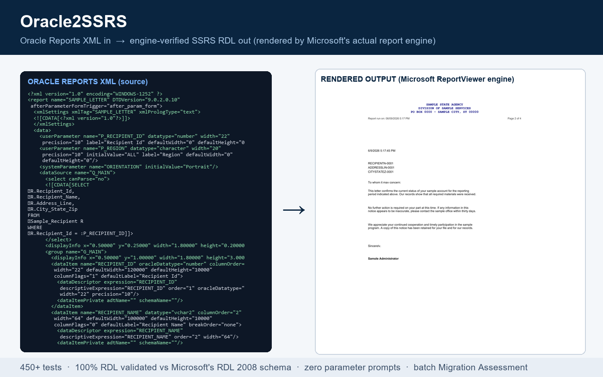

# Oracle Reports to SSRS Converter

Drag an Oracle Reports artifact in, get a deployable SSRS RDL out.

Oracle Reports is desupported. Oracle2SSRS converts your reports to SSRS in
minutes — and **proves** the output instead of promising it:

- **620 automated tests**, including renders through **Microsoft's own
  ReportViewer engine** (the same RDL processing code SSRS runs) with the
  produced PDFs measured for page cadence, blank pages, and geometry.
- **Generated RDL validated** against Microsoft's official RDL 2008 XSD
  schema (`ReportDefinition_2008.xsd`), loaded directly in the test suite.
- **Never prompts for parameter values** — at upload, Refresh Fields, or
  run. Every parameter and query bind ships wired.
- **Batch a whole folder** and get a Migration Assessment: per-report
  effort tiers, fidelity scores, and engine-render verdicts.



## What it does

Oracle2SSRS is a local Flask app that ingests Oracle Reports artifacts —
Oracle Reports XML, raw `.sql`, `.docx` walkthroughs, `.rdf` exports, and
PNG/JPG reference screenshots, including whole folders of mixed files — and
emits a structurally valid SSRS 2008+ `.rdl` you can upload to a real Report
Server. It translates Oracle SQL and PL/SQL formula logic into computable
SSRS expressions, reproduces the original paper-layout geometry, and wires
every parameter so the report runs without prompting.

A four-pane preview lets you verify the conversion before you deploy: the
rendered HTML mockup, the raw RDL, bursting (per-recipient distribution)
detection, and sub-report (drill-through) child generation.

## Proves, not promises

Most converters stop at "the XML parsed." Oracle2SSRS holds its output to
two independent standards that catch different classes of defect:

- **Schema-valid RDL.** Every generated `.rdl` is validated against
  Microsoft's official `ReportDefinition_2008.xsd` using `lxml`'s
  `XMLSchema`. This is enforced across the test suite, so structurally
  invalid RDL cannot ship.
- **Engine-rendered RDL.** XSD validation proves the document is
  well-formed; it cannot prove the report lays out correctly. So
  `tools/renderlab` drives Microsoft's ReportViewer `LocalReport` engine —
  the same RDL processing code SSRS runs — to render real PDFs from
  generated RDLs with synthetic data, then measures them for page cadence,
  blank pages, and geometry. This catches publish-time semantic rules that
  XSD validation cannot (for example aggregate-in-`Lookup`, and
  `TablixMember` `RepeatOnNewPage` consistency).
- **Compile-verified expressions.** A schema-valid RDL that renders can still
  carry a *VB.NET expression* that throws `#Error` the moment the report
  server evaluates it. So every generated `=...` expression — and the report's
  own `<Code>` block — is compiled through the real `System.CodeDom`
  `VBCodeProvider`, the same compilation SSRS performs at publish time. A bad
  `IIf` arity, a trailing comma, an undefined function, or a leaked Oracle `||`
  is caught here, before download, instead of in your live report. (Runs on
  Windows with the .NET Framework; degrades to a clean skip elsewhere.)

Run `python tools/renderlab/fetch_reportviewer.py` once to fetch the
official Microsoft runtime from nuget.org; the rendering checks then run as
part of `pytest`. They degrade gracefully when the engine host is
unavailable.

## Quick start

```bash
git clone https://github.com/Maximilian741/OFR2SSRS.git
cd OFR2SSRS

# Windows
run.bat

# macOS / Linux / WSL
./run.sh
```

The launcher installs dependencies (`pip install -r requirements.txt`) and
starts the app. Then open <http://127.0.0.1:5057> and drop an Oracle Reports
artifact on the page. Override the listen port with `PORT=8080 ./run.sh`.
Requires Python 3.9+.

To install dependencies manually (for example into a virtualenv):

```bash
python -m venv .venv
source .venv/bin/activate        # Windows: .venv\Scripts\activate
pip install -r requirements.txt
```

## How it works — the four-pane UI

Every conversion surfaces **four main tabs**:

- **HTML Mockup** — a render of the layout generated from the parsed
  structure, so you can eyeball the result before you ever open Report
  Builder. Two modes: *frontend* (filled with synthetic sample data) and
  *backend* (a Report-Builder skeleton with field-name placeholders).
- **RDL XML** — syntax-highlighted, structurally valid SSRS RDL. Download it
  and upload straight to your Report Server.
- **Bursting** — automatic detection of Oracle distribution patterns
  (per-recipient PDF output, email blast keys, file-path templates) with a
  downloadable **Burst Pack** containing the recipient query, parameter
  mapping, and a PowerShell DDS-emulator script for SSRS Standard.
- **Sub-Reports** — when the parser detects drill-through child reports, this
  tab lets you upload the child Oracle XML/SQL/DOCX and generates an RDL for
  each child.

Advanced views (side-by-side diff, validation, deploy checklist, and an
Extras panel with the audit trail and AI prompts) are one click away behind
an **Advanced views** toggle.

## Feature highlights

### PL/SQL formula translation

The core feature: a real deterministic compiler — a tokenizer plus a
precedence-climbing parser — not pattern substitution. It compiles an Oracle
`CF_`/`CP_` formula body into an SSRS VB.NET expression that computes inline.

- **Body reduction** folds `IF`/`ELSIF`/`ELSE` and local `var := expr`
  assignments into a single effective return expression (nested `CASE`).
- **Operator and function mappings** include `||` → `&`, `NVL`/`NVL2`/
  `COALESCE` → `IIf(IsNothing(...))`, `DECODE` → nested `IIf`, searched
  `CASE` → nested `IIf`, plus `SUBSTR`→`Mid`, `INSTR`→`InStr`,
  `LENGTH`→`Len`, `UPPER`/`LOWER`→`UCase`/`LCase`, `REPLACE`/`LPAD`/`RPAD`/
  `TRIM`/`INITCAP`, `TO_CHAR`→`Format` (with Oracle→.NET mask translation),
  `TO_NUMBER`→`CDbl`, `TO_DATE`→`CDate`, `ROUND`/`TRUNC`/`FLOOR`/`CEIL`/
  `ABS`/`POWER`/`MOD`/`SIGN`/`GREATEST`/`LEAST`, `SYSDATE`→`Now()`, and
  `CHR(10/13/9)`→`vbLf`/`vbCr`/`vbTab`.
- **Conditional `CP_` placeholders** (side-effect `:CP_X := expr` outputs,
  including build-up and branch assignments) are recovered into a `CASE`.
- **Correlated cross-dataset counts** compile to
  `=LookupSet(key, key, Fields!result.Value, "child").Length`.
- **Honest fallback.** A formula is reported as translated only when the
  *whole* expression compiles with no unknown calls. An external package
  function is recorded as `unresolved`, and when a formula cannot be
  computed the resolver strips the `CF_`/`CP_`/`CS_`/`CG_`/`CT_` prefix and
  binds to a same-stem real column (via `Lookup` if cross-dataset) — so a
  broken expression never reaches SSRS.

The companion SQL translation has a rule-based core (`DECODE`, `NVL`,
`TO_CHAR`, `TO_DATE`, `TRUNC`, `SYSDATE`, `INSTR`, `SUBSTR`, `CHR`, `||`,
`(+)`, `LISTAGG`, `ROWNUM`, bind variables, lexical references) and supports
two SQL targets (see below).

### Parameter filters that actually filter

Oracle reports often build their `WHERE` clause from a **lexical parameter** —
a chunk of SQL *text* (`&P_CRITERIA`) that a `BEFORE REPORT` trigger assembles
at run time from the user's prompts (year, date range, name). SSRS has no
lexical parameter, so a naive conversion drops that text and the report runs
**unfiltered** — the prompts render but do nothing.

Oracle2SSRS recognizes the standard "criteria builder" idiom (a trigger
concatenating `F_Criteria_*_Bind(column, 'P_param')` fragments against
`cv*` column constants) and **reconstructs it into real, `NULL`-safe,
parameter-bound predicates**:

```sql
AND (:P_Year      IS NULL OR TO_CHAR(O.Order_Date,'YYYY') = UPPER(TRIM(:P_Year)))
AND (:P_Date_From IS NULL OR TRUNC(O.Status_Date) >= :P_Date_From)
```

Each declared filter parameter is bound as a real query parameter, so picking a
value filters and leaving it blank widens to all rows — exactly the Oracle
behavior. Only predicates whose column resolves to a known constant are
emitted; anything the tool can't reconstruct with confidence is left with an
honest placeholder rather than a wrong filter.

### Layout fidelity

- **Positional document rendering** — Oracle paper-layout geometry
  (Top/Left/Width/Height) drives the SSRS body. Single-record forms route to
  a positioned per-record body; tabular sources get a grid. The generator
  picks the right `<Body>` shape for the source's frame structure instead of
  forcing every report into one mold.
- **Per-segment mixed fonts** — a mixed-font Oracle text field (for example
  an unbold caption next to a bold value) is parsed into runs and emitted as
  one paragraph per segment, each keeping its own weight, size, italic,
  underline, and color; it collapses to the uniform path when the segments
  do not actually differ.
- **Embedded seals / logos / watermarks** — images stored in the Oracle
  export's `binaryData` (both inline and document-level styles, including a
  nibble-swapped hex encoding some exports use) are decoded, MIME-sniffed,
  and emitted as RDL `<EmbeddedImages>` and into the mockup. Layout
  placeholders without bytes get an upload slot in the sidebar, previewed
  live in the mockup.
- **White-border-over-watermark fix** — a white border on a white or
  transparent textbox is invisible on the page but paints over a seal; the
  generator suppresses it (`BorderStyle=None`) in that case while keeping a
  real white gridline over a colored background.
- **Rotated fields** — Oracle `rotationAngle` (for example a sideways
  window-envelope address) maps to SSRS `WritingMode` Rotate270.
- **Color resolution** — Oracle color names and indices are resolved to hex.

### Sub-reports, drill-through, and envelopes

When the parser detects drill-through child reports, the Sub-Reports tab
generates an RDL for each child, declaring the parent's drill-through
parameters. Parameterized links to an envelope/cover report are emitted with
a deploy note, and rotated-field handling covers window-envelope address
blocks.

### Bursting

Oracle distribution patterns (per-recipient PDF output, email blast keys,
file-path templates) are detected and packaged into a downloadable **Burst
Pack**: the recipient query, the parameter mapping, and a PowerShell
DDS-emulator script that reproduces Data-Driven Subscription behavior on SSRS
Standard.

### Batch migration + Migration Assessment

Point the CLI at a whole folder of Oracle XML exports:

```bash
python tools/batch_convert.py path/to/reports -o out --render
```

Every report is converted, preflighted, fidelity-scored, optionally
render-verified through the MS engine, and classified into an effort tier
(`automatic` / `light-touch` / `assisted` / `manual`). You get
`out/rdl/*.rdl`, a printable `ASSESSMENT.html` executive summary, and a
`migration_pack.zip`. The same flow is available in the app sidebar ("Batch
migration") and over HTTP (`POST /api/batch`). The Community Edition
processes up to 10 reports per batch (single-report conversion is always
unlimited); set `O2S_LICENSE=pro` to lift the cap.

### Zero-prompt parameters and data-source binding

- **Shared data source reference** — the RDL emits a
  `<DataSourceReference>` to a named shared data source (with cached
  credentials) rather than an embedded connection block. This is the
  load-bearing design that stops the "Define Query Parameters" prompt at
  Refresh Fields. Type your report server's shared data source path once in
  the sidebar (for example `/Data Sources/MyOracle`) and every generated
  artifact — main RDL, sub-report RDLs, the burst pack — ships pre-bound to
  it.
- **Parameters never prompt** — undeclared query binds and system/path
  parameters bind to an empty `=Nothing` default rather than triggering a
  runtime prompt, and every query bind is wired. The "Define Query
  Parameters" dialog never pops, at upload, Refresh Fields, or run.
- **Hidden internal vs visible user params** — Oracle parameters marked
  `display="no"`, and system/internal name patterns, become hidden
  ReportParameters; genuine user parameters stay visible.
- **Dual SQL target** — the default (`oracle`) preserves the original
  Oracle SQL with `:P_PARAM` binds and the OracleClient provider; the
  `sqlserver` target emits translated T-SQL with `@P_PARAM` binds and the
  SQL provider.

### Heterogeneous ingest

Drop mixed artifacts and the ingester classifies each blob
(`primary_xml` / `rdf_binary` / `sql_files` / `pdfs` / `docs` /
`screenshots` / `unknown`) with a per-file confidence note, then runs
whatever subset of the pipeline is feasible:

- **`.rdf` onboarding** — `.rdf` is Oracle's proprietary binary and is not
  parseable directly; the app replies with the exact one-line `rwconverter`
  command (Oracle's own tool) to export it to the XML this converter
  consumes, including the wildcard form for whole folders.
- **Raw `.sql` and `.docx`** — `.sql` files (and SQL extracted from `.docx`
  walkthroughs) become synthetic datasets when no XML is present.
- **Partial artifacts** — incomplete exports (a customization overlay, a
  data-model-only export, a layout fragment) get a plain-language verdict
  instead of a near-blank RDL.
- **Encoding robustness** — best-effort decode tries utf-8 / utf-8-sig /
  cp1252 / latin-1 before a replace fallback.

### Pre-flight audit and cross-validation

The parser cross-checks bind variables, parameter names, and column
references against any `.sql`, `.docx`, or screenshot you dropped in, and
surfaces a pre-flight audit.

### Optional Claude auto-fix

If `ANTHROPIC_API_KEY` is set in `.env`, the Extras tab can call Claude once
per AI prompt, validate each result, and patch the RDL in place. Without a
key the prompt templates are still rendered for paste-into-Copilot use.

### Bundle download

One click produces a `.zip` of the RDL, validation report, deploy checklist,
audit trail, AI prompts, burst pack, and a README explaining what's inside.

## Manual deploy workflow

The converter intentionally stops at the file boundary — it does not push to
a Report Server. After downloading the `.rdl`:

1. Upload it to your SSRS folder (Report Manager or Report Builder).
2. Open the report's Data Source properties and point it at the shared data
   source already configured in that folder.
3. Open the dataset and **Refresh Fields** — no parameter prompt should
   appear (this is what the shared-data-source reference buys you).
4. Save, view, export to PDF for end users.

## Architecture

Pipeline: parse the Oracle artifact into a single `ParsedReport` dataclass,
translate SQL and PL/SQL formula logic, generate the RDL, render previews,
validate, and build the deploy checklist and burst pack. Every module reads
or writes the same dataclass.

See [docs/ARCHITECTURE.md](docs/ARCHITECTURE.md) for the module-by-module
breakdown and [docs/API.md](docs/API.md) for the HTTP endpoint reference.

## Testing

```bash
pip install -r requirements.txt
python -m pytest -q
```

The suite is 620 tests. It validates generated RDL against Microsoft's RDL
2008 XSD and, when the ReportViewer runtime is present, renders RDLs through
Microsoft's engine and measures the resulting PDFs.

## Development

```bash
python backend/cli.py samples/oracle --out ./out --strict
```

`backend/cli.py` runs a plain conversion (`--out`, `--strict`, `--quiet`);
`tools/batch_convert.py` runs the batch Migration Assessment (`-o`,
`--render`, `--target-db`).

## Contributing

See [CONTRIBUTING.md](CONTRIBUTING.md) for setup, test, and pull request
guidelines.

## License

**Elastic License 2.0** (source-available). In plain terms:

- Free to use, modify, and run inside your organization — convert as many of
  your own reports as you like.
- Free to evaluate, fork, and contribute.
- You may not offer Oracle2SSRS itself to third parties as a hosted or
  managed service.
- You may not remove or circumvent the license-key functionality
  (`O2S_LICENSE` tiers).

Commercial licenses (Pro / Enterprise: unlimited batch, white-label
Migration Assessments, support) — open an issue or contact the author. Full
text in [LICENSE](LICENSE).
